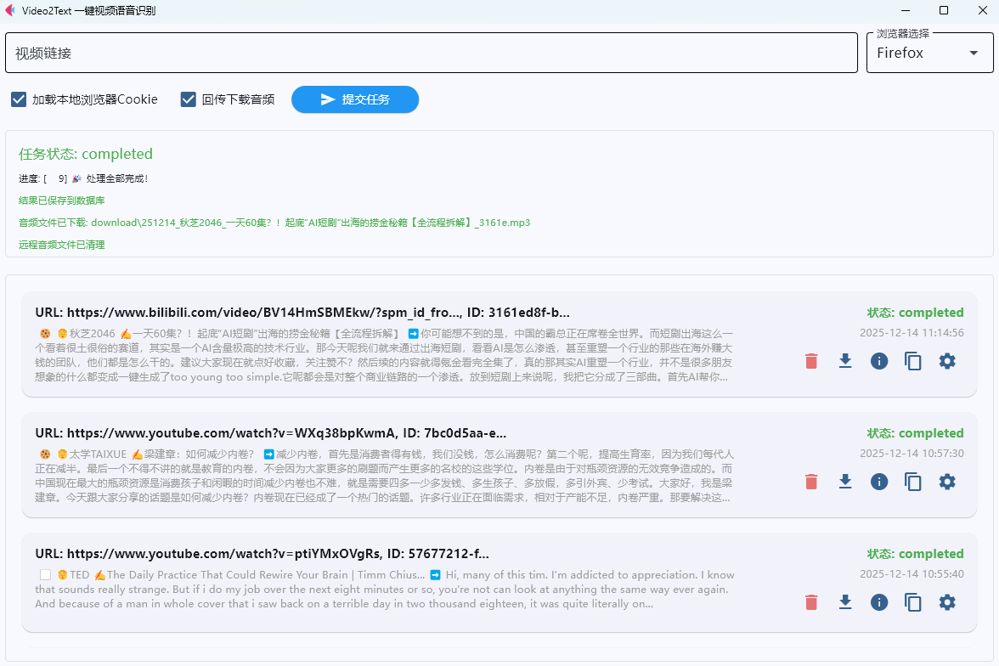

# Video to Text Converter

基于Flet的一键视频文字语音识别与管理工具

1. 本仓库为GUI Client前端程序，需要搭配Server后端程序使用（https://github.com/tk166/Video2Text `python converter_app_remote.py`）
2. MIT协议

## 功能特性

1. 前后端分离设计，可在多台PC上安装前端（运行GUI），共用同一台PC上部署的后端（运行FunASR语音识别模型）
2. 视频链接输入、浏览器选择（Firefox/Edge/Chrome）、Cookie加载选项（自动获取并加密浏览器Cookie）
3. 回传下载音频
4. 任务提交与状态监控
5. 历史任务管理
6. 结果操作（复制文本、编辑字幕、导出字幕）
7. 完全基于Pyhthon，可跨平台使用





## Cookie处理机制

本应用使用`rookiepy`库自动获取本地浏览器的Cookie信息，并通过以下步骤确保安全传输：

1. **浏览器支持**: 自动支持Firefox、Edge和Chrome浏览器
2. **Cookie获取**: 从用户选择的浏览器中提取Cookie信息
3. **数据加密**: 使用`cryptography`库和本地密钥文件对Cookie进行加密
4. **安全传输**: 将加密后的Cookie数据发送到远程服务器
5. **异常处理**: 完善的错误处理机制应对各种异常情况

## 安装依赖

```bash
pip install -r requirements.txt
```

## 运行应用

```bash
python main.py
```

## 使用说明

1. 在输入框中粘贴视频链接
2. 选择要使用的浏览器类型
3. 根据需要勾选Cookie加载和音频回传选项
4. 点击"提交任务"按钮开始处理
5. 在任务状态区域查看处理进度
6. 在历史任务列表中查看之前的任务
7. 对已完成的任务进行结果操作